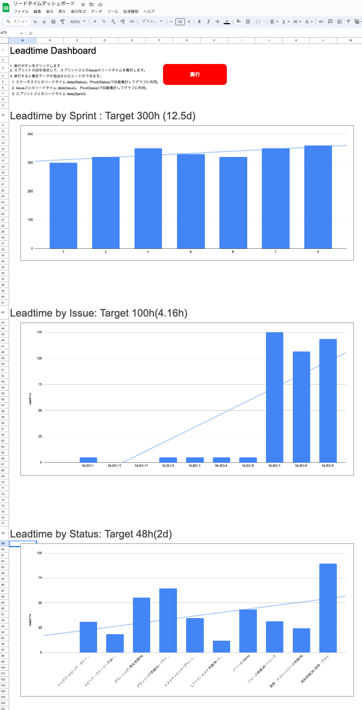

# jira-leadtime-dashboard-gas

I am using GAS to extract lead time information from JIRA and create a dashboard.

# Installation

* You can copy the spreadsheet from https://docs.google.com/spreadsheets/d/1VkowxbSTkegDlvMfpg_FYBcHOue0n7sKudGwkuDTAPs/edit?usp=sharing
* or copy my code to your app script.

# Settings

* Got to Project setting > Project properties.
* And setting properties as below.
  * PROJECT_ID： Target JIRA project ID. e.g. NLBO
  * BASE_URL： JIRA REST API base url. e.g. https://example.atlassian.net
  * JIRA_USER_NAME： JIRA user name(email). e.g. example@gmail.com
  * API_TOKEN： API_TOKEN： Create from https://id.atlassian.com/manage-profile/security/api-tokens
