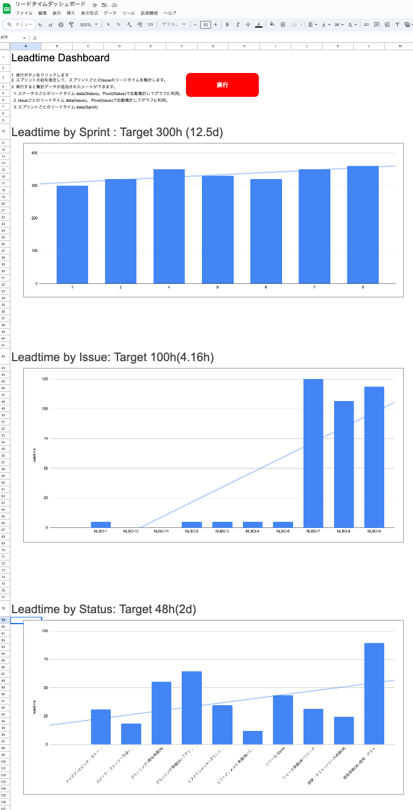

# jira-leadtime-dashboard-gas



I am using GAS to extract lead time information from JIRA and create a dashboard.

# Google app script

## Installation

- You can copy the spreadsheet from https://docs.google.com/spreadsheets/d/1VkowxbSTkegDlvMfpg_FYBcHOue0n7sKudGwkuDTAPs/edit?usp=sharing
- or copy my code from `/gas` to your app script.

## Settings

- Got to Project setting > Project properties.
- And setting properties as below.
  - PROJECT_ID： Target JIRA project ID. e.g. NLBO
  - BASE_URL： JIRA REST API base url. e.g. https://example.atlassian.net
  - JIRA_USER_NAME： JIRA user name(email). e.g. example@gmail.com
  - API_TOKEN： API_TOKEN： Create from https://id.atlassian.com/manage-profile/security/api-tokens

# TypeScript

## Installation

Create `.env` file in `/typescript`.

```
# example

## JIRA Project ID
PROJECT_ID="NLBO"

## REST API base url
BASE_URL="https://${YOUR_DOMAIN}.atlassian.net"

## JIRA user name
JIRA_USER_NAME="${YOUR_EMAIL}@gmail.com"

## API token from https://id.atlassian.com/manage-profile/security/api-tokens
API_TOKEN="${YOUR_KEY}"
```

And run `index.ts`.

```
npx tsc && node ./dist/index.js
```

## Appendix. Preparation note

```
# Node project initialization
npm init -y  # create package.json and modify it for your environment.

# Install TypeScript
npm install typescript -D
npm install @types/node -D
npm install dotenv -D
```

### TSConfig settings

see: https://github.com/microsoft/TypeScript/wiki/Node-Target-Mapping

```
npx tsc --init
```

Example:

```
//tsconfig.json
{
  "compilerOptions": {
    "lib": ["ES2023"],
    "module": "nodenext",
    "target": "esnext"
  }
}
```
